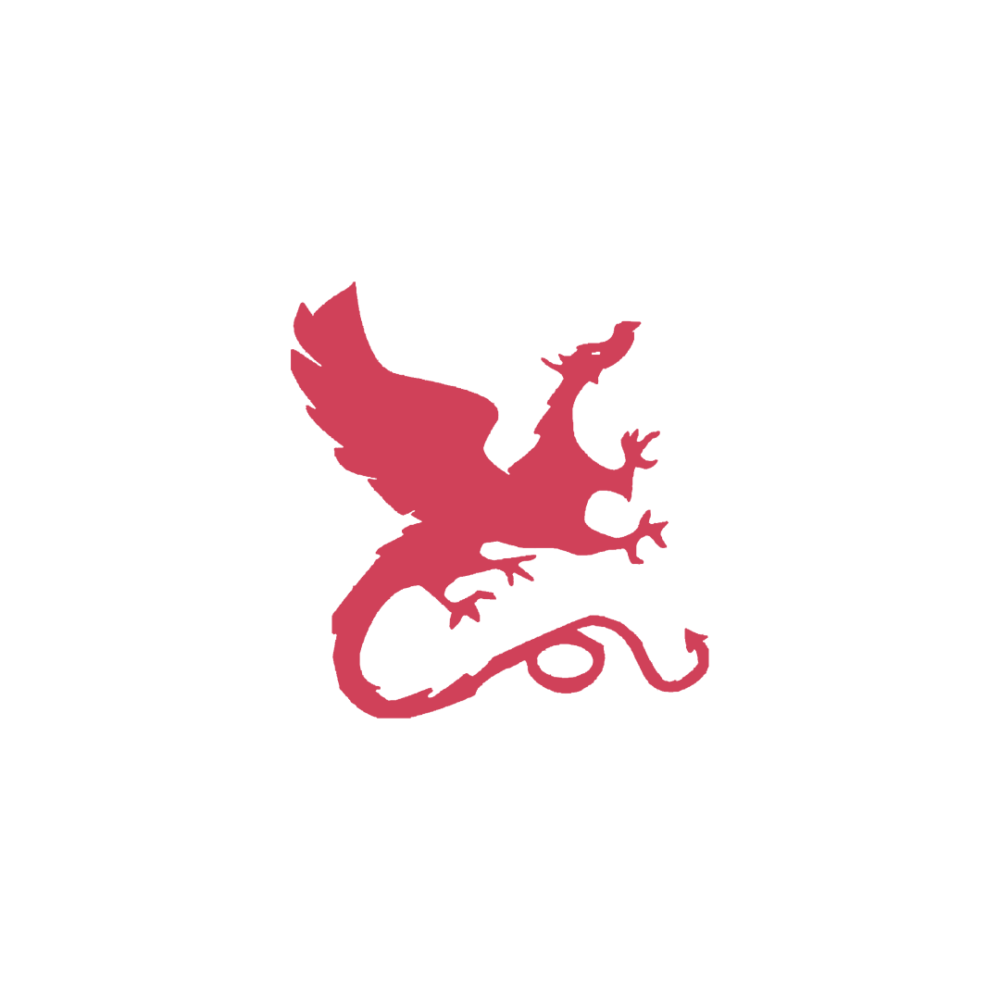

  

  

  &#8287;&#8287;&#8287;&#8287;&#8287;
  
  &#8287;&#8287;&#8287;&#8287;&#8287;
  
  &#8287;&#8287;&#8287;&#8287;&#8287;
  

  

## About Me

Hi, I am a Canadian International Bacculaureate Student, Founding SWE [@EduBeyond](https://github.com/EduBeyond), and Incoming AI & CS @ Carnegie Mellon School of Computer Science

In the past, I've co-founded [vsHacks](https://vshacks.tech/), Vancouver's largest high school hackathon, and I've built [Blockout](https://github.com/vincor-qc/blockout), some Minecraft minigame I played with friends during the pandemic.

## Tech

## Contact

  
  <code>
  vincor_
  </code>

  
  <code>vincent@edubeyond.ai</code>

  
  <code>
  vqi@andrew.cmu.edu
  </code>

  

# Some Stats

<table>
  <tr>
    <td align="center" style="padding=0;width=50%;">
      
    </td>
    <td align="center" style="padding=0;width=50%;">
      
    </td>
  </tr>
</table>
