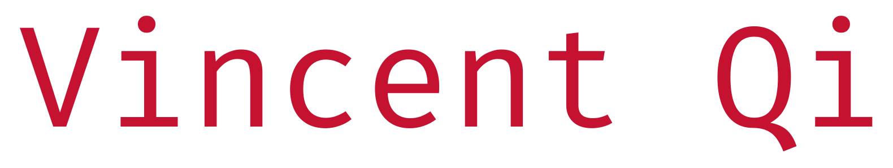

  

  

  &#8287;&#8287;&#8287;&#8287;&#8287;&#8287;&#8287;&#8287;&#8287;&#8287;&#8287;&#8287;&#8287;&#8287;&#8287;&#8287;&#8287;&#8287;&#8287;&#8287;&#8287;
  
  &#8287;&#8287;&#8287;&#8287;&#8287;
  
  &#8287;&#8287;&#8287;&#8287;&#8287;
  
  

  

### About Me
Hi, I'm Vincent, a CS student at Carnegie Mellon University.

Currently, I'm a software engineer at **Mercor**, where I develop RLHF data pipelines.

Previously, I started **EduBeyond** (now Futurity) at age 16, and AI Learning Management System startup. 

Feel free to reach out, I'm always open to meeting new people :)

 
  

 <pre>vincor_</pre>

 <pre>vqi [at] andrew.cmu.edu</pre>

