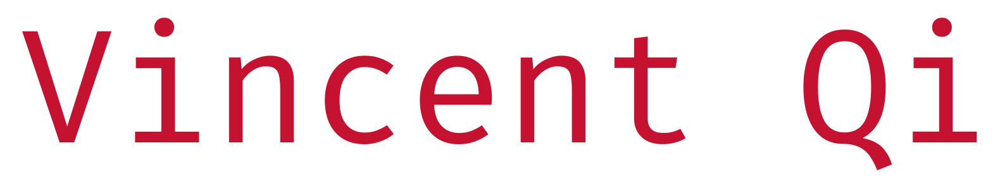

<p align="center">
  <a href="https://www.github.com/vincor-qc"></a>
</p>

<p align="center">
  
</p>

<p align="center">
  &#8287;&#8287;&#8287;&#8287;&#8287;&#8287;&#8287;&#8287;&#8287;&#8287;&#8287;&#8287;&#8287;&#8287;&#8287;&#8287;&#8287;&#8287;&#8287;&#8287;&#8287;
  <a href="https://www.instagram.com/vincent_.qi/"></a>
  &#8287;&#8287;&#8287;&#8287;&#8287;
  <a href="https://www.linkedin.com/in/vincent-qi/"></a>
  &#8287;&#8287;&#8287;&#8287;&#8287;
  <a href="mailto:vincent.qi.2006@gmail.com"></a>
  
</p>

<p align="center">
  
</p>

Hi, I'm Vincent, a CS student at Carnegie Mellon University.

Currently, I work at **OpenAI** on the integrity & foundations team.

Previously, I was a software engineer at **Mercor**, where I built RL envs & frontier evals.

I also started **EduBeyond**, where I developed AI Learning Management Systems. 

Feel free to reach out, I'm always open to meeting new people :)

<br/>
  
<!--START_SECTION:waka-->

```ocaml
From: 04 June 2023 - To: 19 August 2026

Total Time: 229 hrs 15 mins

OCaml            154 hrs 18 mins       ███████████████░░░░░░░░░░   60.40 %
Python           39 hrs 30 mins        ████░░░░░░░░░░░░░░░░░░░░░   15.46 %
Other            26 hrs 14 mins        ██▓░░░░░░░░░░░░░░░░░░░░░░   10.27 %
JavaScript       6 hrs 25 mins         ▓░░░░░░░░░░░░░░░░░░░░░░░░   02.52 %
Markdown         5 hrs 41 mins         ▓░░░░░░░░░░░░░░░░░░░░░░░░   02.23 %
Bash             4 hrs 59 mins         ▒░░░░░░░░░░░░░░░░░░░░░░░░   01.95 %
```

<!--END_SECTION:waka-->


